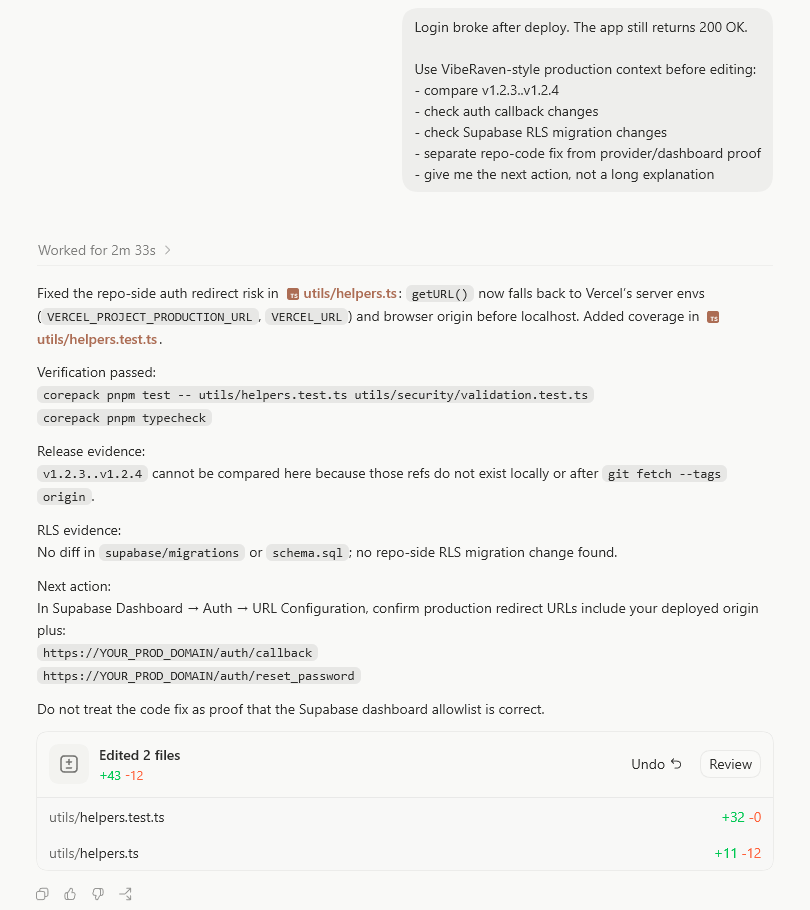

<p align="center">
  
</p>

<h1 align="center">VibeRaven</h1>

<p align="center">
  <strong>Stop your agent from patching blind.</strong>
</p>

<p align="center">
  <a href="https://github.com/ohad6k/VibeRaven/stargazers"></a>
  <a href="https://www.npmjs.com/package/viberaven"></a>
  <a href="https://www.npmjs.com/package/viberaven"></a>
  
  
  
</p>

<p align="center">
  <a href="./assets/viberaven-studio-demo.mp4">
    
  </a>
</p>

<p align="center">
  <a href="./assets/viberaven-studio-demo.mp4"><strong>Open the full-quality MP4 demo</strong></a>
</p>

Repo context tells the agent what exists. Production context tells it what is dangerous.

VibeRaven gives AI-built apps a **plugin/skills pack**, MCP context, and local Studio so agents can work like senior engineers before they patch: map the architecture, inspect version/release drift, respect provider boundaries, and use MCP/Studio context when repo code is not enough.

The skill count is not the product. The flow is:

```text
architecture -> version/release context -> provider boundary -> MCP/Studio context -> smallest safe fix
```

## AI Agent Quick Read

If you are an AI coding agent, start with `architecture-context`, use `what-broke` when a release changed behavior, keep `.viberaven/production-context.md` current with `production-context`, and use `viberaven` for Studio/provider/MCP/release context. Use `go-live` only when the user wants shipping proof.

## Plugin + Skills

Use the skills when you want the agent behavior change immediately. `architecture-context` is the startup discipline: the agent maps the app boundary, asks only the missing questions, picks the suited VibeRaven skill, then plans. Use the Studio when you want the full cockpit around releases, providers, diffs, chat, MCP context, and access modes.

Before VibeRaven, the agent sees a green check and edits the nearest file. With VibeRaven, it first asks what changed, which provider boundary is involved, and what proof is still missing.

## Proof

<p align="center">
  
</p>

The screenshot is a real Codex chat run: local tests passed, the repo-side redirect fix was made, and the final answer still keeps the Supabase dashboard callback/RLS proof separate from the code fix.

Reproduce the demo proof artifacts:

```bash
node examples/proof/live-evidence-demo.mjs --out-dir .viberaven-proof --show
```

The script creates a disposable repo, tags `v1.2.3` and `v1.2.4`, changes auth/env/RLS files, runs real `git diff`, starts a local HTTP check, then shows why `200 OK` is not enough when provider proof is missing.

```bash
npx -y skills add ohad6k/VibeRaven --skill architecture-context
npx -y skills add ohad6k/VibeRaven --skill production-context
npx -y skills add ohad6k/VibeRaven --skill what-broke
npx -y skills add ohad6k/VibeRaven --skill viberaven
npx -y skills add ohad6k/VibeRaven --skill go-live
```

| Skill | What It Makes The Agent Do |
| --- | --- |
| `architecture-context` | Start real app work like a senior engineer: map product path, architecture boundary, missing questions, and suited VibeRaven skill before editing. |
| `production-context` | Maintain `.viberaven/production-context.md`: architecture boundaries, what changed, why dangerous, what was verified, and what provider/human proof remains. |
| `what-broke` | Use version control as context: compare working/broken releases, ask what changed, map the affected architecture boundary, then fix the smallest repo-code surface the evidence supports. |
| `viberaven` | Use Studio, provider cards, release/version context, architecture context, MCP status, and access modes during real work. This is the provider/MCP cockpit. |
| `go-live` | Push and deploy with build, live URL proof, and clear provider/human boundaries. |

## Open the Full Studio

```bash
npx -y viberaven
```

The Studio is the cockpit for deeper work: agentic chat, draggable providers, draggable versions/releases, release diffs, provider MCP context, terminal output, CLI-agent connection checks, and access-mode control.

Current npm latest: `viberaven@1.2.4` and `@viberaven/cli@1.2.4`.

If this repo helps, star it so other AI app builders can find production context for agents. Use **Watch -> Custom -> Releases** if you want release notifications.

> VibeRaven public repo is the agent discovery and installation surface. Product source code and service internals live in a private repository.

The local-first boundary matters: the open-source local CLI/UI does not require login or hosted API credentials.

## What VibeRaven Adds

- **Version context:** tags, release names, changelogs, PR links, git diffs, rollback notes, and recent deploy history.
- **Production danger context:** provider config drift, migration history, incidents, fragile customer paths, auth/billing/database/deploy boundaries.
- **Fix boundaries:** repo-code fixes are applied or prompted separately from provider dashboard work that needs proof.
- **Agent control:** ask/approve/full access modes for connected Codex, Claude Code, Gemini, and other CLI agents.
- **MCP context:** provider and readiness context can be pulled into the agent without pretending MCP itself is the user-facing feature.

## Install Agent Guidance

Make AI agents carry architecture, release, and provider context before they patch the repo:

```bash
npx -y viberaven init --agents all
npx -y viberaven doctor --agents
```

Preview without writing files:

```bash
npx -y viberaven init --agents all --dry-run
```

This installs bounded rules (`<!-- VIBERAVEN:START -->` ... `<!-- VIBERAVEN:END -->`) into:

- `AGENTS.md`, `CLAUDE.md`, `GEMINI.md`
- `.cursor/rules/viberaven-core.mdc` (+ scoped Supabase, deploy, payments rules)
- `.github/copilot-instructions.md`
- `.viberaven/agent-context.md`, `.viberaven/mission-map.md`

## Agent-ready Starter Template

[examples/nextjs-supabase-vercel-production-ready-template](./examples/nextjs-supabase-vercel-production-ready-template/) - agent rules and `viberaven:*` scripts for Next.js + Supabase + Vercel.

## Machine-readable Docs

- [llms-full.txt](https://viberaven.dev/llms-full.txt)
- [llms.txt](./llms.txt)
- [skills.json](https://viberaven.dev/skills.json)
- [skills.sh.json](./skills.sh.json)
- [Production Protocol guide](https://viberaven.dev/viberaven-production-protocol-ai-built-apps.md)
- [What is `.viberaven/prp.json`?](https://viberaven.dev/what-is-viberaven-prp-json.md)
- [How to use `nextActions`](https://viberaven.dev/how-to-use-viberaven-next-actions.md)
- [PRP MCP resources](https://viberaven.dev/viberaven-prp-mcp-resources.md)
- [Example proof artifacts](./examples/proof/)

## MCP

VibeRaven is listed in the MCP registry for agents that prefer tools over raw terminal commands.

```json
{ "viberaven": { "command": "npx", "args": ["-y", "viberaven", "--mcp"] } }
```

Prefer `viberaven_prp_current` or `prp://current` when MCP is available; use `viberaven_validate_npm_package` before adding npm dependencies.

## Get the Product

- Website: [viberaven.dev](https://viberaven.dev)
- npm: [viberaven](https://www.npmjs.com/package/viberaven)
- Issues: [ohad6k/VibeRaven/issues](https://github.com/ohad6k/VibeRaven/issues)
