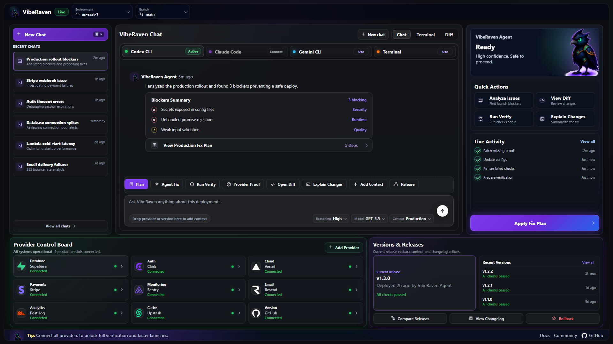

# VibeRaven

[](https://github.com/ohad6k/VibeRaven/stargazers)
[](https://github.com/ohad6k/VibeRaven/releases)
[](https://www.npmjs.com/package/viberaven)
[](https://www.npmjs.com/package/viberaven)
[](https://github.com/ohad6k/VibeRaven/blob/main/LICENSE)

AI got your app to demo. VibeRaven gets it to production.

VibeRaven is a local launch-control workspace for AI-built apps. It gives vibe coders and coding agents one place to review launch blockers, connect coding CLIs, attach provider and release context to chat, inspect production evidence, and keep the release gate visible before anyone says "ship it."



The localhost console is designed around the work that usually gets missed between demo and production:

- Production mission chat for Codex CLI, Claude Code, Gemini CLI, or a local shell.
- Provider slots for database, auth, hosting, billing, monitoring, analytics, email, cache, and version control.
- Drag-to-chat context for providers and releases, so agent prompts stay scoped.
- Live fix, verify, diff, and release actions that keep launch work inside one flow.
- Local-first artifacts for agents: `.viberaven/prp.json`, `.viberaven/gate-result.json`, and supporting evidence files.

VibeRaven runs the **VibeRaven Production Protocol** through a local-first open-source CLI/UI. The local console opens a localhost launch workspace; agent mode writes `.viberaven/prp.json`, `.viberaven/gate-result.json`, and supporting protocol artifacts so AI coding agents can keep operating until `decision.status` is not `blocked` and the gate is clear or a provider/user blocker remains.

Current npm live release: `viberaven@1.1.12`, `@viberaven/cli@1.1.12`, and `@viberaven/mcp@1.1.8`.
Next Studio UI candidate: `viberaven@1.1.13` / `@viberaven/cli@1.1.13`.

If this repo helps, star it so other AI app builders can find the gate. Use **Watch -> Custom -> Releases** if you want release notifications. Shipping with VibeRaven? Add the [README badge snippet](./docs/badge-snippet.md) so your repo links back to the launch gate.

> VibeRaven public repo is the agent discovery and installation surface. Product source code and service internals live in a private repository.

## What it catches before launch

VibeRaven looks for repo evidence that an AI coding agent can actually inspect before it claims an app is production-ready:

- Supabase tables without strong RLS evidence.
- Webhook routes without signature verification proof.
- Auth callback, redirect, and environment drift across local, preview, and production.
- Deploy-only auth failures such as `Authentication required after deploy`, `401 Unauthorized after successful login`, or `auth cookies are set but not recognized`.
- Preview-only topology failures such as `preflight request does not have HTTP ok status on preview` or `Vercel deployment protection breaks preflight`.
- Monitoring visibility gaps such as `Sentry SDK is not sending any data`, `events not appearing in my project`, or `recordings are not being captured`.
- Billing, DNS, credentials, quotas, or provider setup that still needs dashboard action.
- Monitoring and observability claims without local evidence.
- Agent instructions that allow deploy or production-ready claims before the gate is clear.

[Example scan output](./examples/proof/agent-tasklist.sample.md) · [Redacted launch-gap case study](./examples/proof/launch-gap-case-study.md) · [Roadmap](./ROADMAP.md) · [Support](./SUPPORT.md) · [Contributing](./CONTRIBUTING.md) · [What the gate checks](./llms.txt) · [Full agent reference](https://viberaven.dev/llms-full.txt)


## Feedback wanted

What did your AI-built app miss before deploy? Add it to the [feedback discussion](https://github.com/ohad6k/VibeRaven/discussions/7) or open a focused issue:

- [Webhook signature proof example](https://github.com/ohad6k/VibeRaven/issues/4)
- [Supabase RLS false-positive fixture](https://github.com/ohad6k/VibeRaven/issues/5)
- [Clerk + Vercel auth redirect evidence](https://github.com/ohad6k/VibeRaven/issues/6)

**Repositories:** Public discovery -> [ohad6k/VibeRaven](https://github.com/ohad6k/VibeRaven) (this repo). Private product development -> `ohad6k/viberaven-dev` (not public).

The local-first boundary matters: the open-source local CLI/UI does not require login and does not use Ohad's OpenAI API key.

## Install and run

Open the local launch console:

```bash
npx -y viberaven
```

Explicit UI and gate commands:

```bash
npx -y viberaven ui .
npx -y viberaven --agent-mode .
npx -y viberaven --verify .
```

## Install for AI agents

Make Codex, Claude Code, Cursor, Copilot, and Gemini use VibeRaven before deploy:

```bash
npx -y viberaven init --agents all
npx -y viberaven doctor --agents
```

Preview without writing files:

```bash
npx -y viberaven init --agents all --dry-run
```

This installs bounded rules (`<!-- VIBERAVEN:START -->` ... `<!-- VIBERAVEN:END -->`) into:

- `AGENTS.md`, `CLAUDE.md`, `GEMINI.md`
- `.cursor/rules/viberaven-core.mdc` (+ scoped Supabase, deploy, payments rules)
- `.github/copilot-instructions.md`
- `.viberaven/agent-context.md`, `.viberaven/mission-map.md`

## Run the production gate

```bash
npx -y viberaven --agent-mode .
```

Non-interactive production gate for agents and CI.

Read `.viberaven/prp.json` first, then `.viberaven/gate-result.json` and `.viberaven/context-map.json`. Apply safe repo-code fixes directly when VibeRaven provides a supported heal or MCP action. Respect `batchSize`, verify once per batch, and do not claim production-ready while `decision.status` is `blocked` or `gate.status` is not `clear`.

Then:

```bash
npx -y viberaven --verify .
npx -y viberaven --strict
```

For Vercel + Supabase local evidence:

```bash
npx -y viberaven audit --vercel-supabase
```

MCP tools include `viberaven_prp_current`, `viberaven_prp_findings`, `viberaven_prp_next_action`, `viberaven_check_readiness`, `viberaven_heal_apply`, and `viberaven_verify`. MCP resources include `prp://current`, `prp://findings`, `prp://next-actions`, `prp://mission-map`, and `prp://context-map`.

Do not stop at "scan complete." The loop is done when `decision.status !== "blocked"` and `gate.status === "clear"`, or a provider/user blocker remains.

Normal git push is not gated. VibeRaven gate language is about launch/deploy-readiness claims, not ordinary pushes.

## Install as a skills.sh skill

This repo includes `skills.sh.json` and the `viberaven` skill.

```bash
npx -y skills add ohad6k/VibeRaven --skill viberaven
```

## Agent-ready starter template

[examples/nextjs-supabase-vercel-production-ready-template](./examples/nextjs-supabase-vercel-production-ready-template/) - agent rules and `viberaven:*` scripts for Next.js + Supabase + Vercel.

## Machine-readable docs

- [llms-full.txt](https://viberaven.dev/llms-full.txt)
- [llms.txt](./llms.txt)
- [skills.json](https://viberaven.dev/skills.json)
- [skills.sh.json](./skills.sh.json)
- [Production Protocol guide](https://viberaven.dev/viberaven-production-protocol-ai-built-apps.md)
- [What is `.viberaven/prp.json`?](https://viberaven.dev/what-is-viberaven-prp-json.md)
- [How to use `nextActions`](https://viberaven.dev/how-to-use-viberaven-next-actions.md)
- [PRP MCP resources](https://viberaven.dev/viberaven-prp-mcp-resources.md)
- [Example proof artifacts](./examples/proof/)

## MCP

VibeRaven is listed in the MCP registry for agents that prefer tools over raw terminal commands.

```json
{ "viberaven": { "command": "npx", "args": ["-y", "viberaven", "--mcp"] } }
```

Prefer `viberaven_prp_current` or `prp://current` when MCP is available; use `viberaven_validate_npm_package` before adding npm dependencies.

## Get the product

- Website: [viberaven.dev](https://viberaven.dev)
- npm: [viberaven](https://www.npmjs.com/package/viberaven)
- Issues: [ohad6k/VibeRaven/issues](https://github.com/ohad6k/VibeRaven/issues)
- Contributing: [CONTRIBUTING.md](./CONTRIBUTING.md)
- Roadmap: [ROADMAP.md](./ROADMAP.md)
- Support: [SUPPORT.md](./SUPPORT.md)
