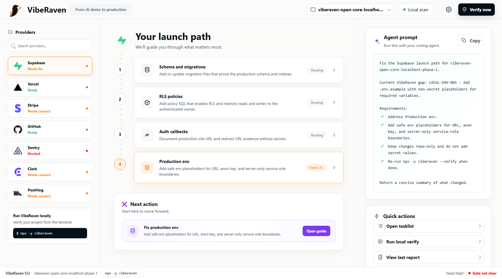

# VibeRaven

Local launch console for AI-built apps that need to become safe enough for real users.

<p>
  <a href="https://www.npmjs.com/package/viberaven"></a>
  <a href="./LICENSE"></a>
  
  
</p>

VibeRaven turns "the AI demo runs on my machine" into a concrete local launch map. Run it in a repo and it opens a localhost console with provider readiness, repo-evidence gaps, a copyable agent prompt, a tasklist, and a verify loop.

```bash
npx -y viberaven
```

<p>
  
</p>

## Why It Exists

AI coding tools are strong at getting an app to demo. The hard part is the last mile: auth callbacks, RLS policy evidence, production env names, deploy checks, webhooks, monitoring, and tests. VibeRaven gives the developer and the coding agent the same local map of what is still missing.

Normal git push is not gated by VibeRaven. Use gate language only when making launch or deploy-readiness claims.

## What It Catches

| Area | Local evidence VibeRaven looks for |
| --- | --- |
| Data safety | Supabase folders, migration hints, RLS-related source evidence |
| Auth | Callback and redirect configuration evidence |
| Deploy | Vercel/package scripts, production env examples, build commands |
| Payments | Stripe-related source and webhook evidence |
| Operations | Sentry/PostHog hints, tests, monitoring and task artifacts |
| Agent handoff | A focused prompt for the first repo-owned launch gap |

## Quickstart

Use the published package from any project folder:

```bash
npx -y viberaven
npx -y viberaven ui .
npx -y viberaven scan .
npx -y viberaven --agent-mode .
npx -y viberaven --verify .
```

The default TTY experience opens the local console. Agent-oriented commands keep terminal behavior predictable:

- `viberaven --agent-mode .` writes artifacts and prints the tasklist.
- `viberaven --verify .` refreshes local evidence and returns a strict exit code.
- `viberaven ui .` opens the localhost console directly.

## Local Artifacts

VibeRaven writes reviewable local files under `.viberaven/`:

| File | Purpose |
| --- | --- |
| `.viberaven/agent-tasklist.md` | The prioritized gaps a coding agent should fix first |
| `.viberaven/gate-result.json` | Machine-readable launch gate result |
| `.viberaven/context-map.json` | Compact repo evidence map for agents |
| `.viberaven/mission-map.md` | Human-readable launch path and reasoning |

The scan is local-first and does not need production secrets.

## Build From Source

```bash
npm install
npm --prefix packages/cli run build
```

## Run From Source

```bash
node packages/cli/dist/cli.js --help
node packages/cli/dist/cli.js ui .
node packages/cli/dist/cli.js scan .
node packages/cli/dist/cli.js --agent-mode .
node packages/cli/dist/cli.js --verify .
```

## The Workflow

1. Open the local console with `npx -y viberaven`.
2. Pick the provider with the highest launch risk.
3. Copy the focused agent prompt.
4. Fix one repo-owned gap.
5. Run `npx -y viberaven --verify .`.

The loop is intentionally small. One concrete fix, one verification pass, one updated map.

## How It Works

VibeRaven reads local repo evidence only: package metadata, env examples, deployment config, Supabase folders, tests, and provider-related source hints. It does not read real secret values. It maps that evidence into provider launch paths and gives coding agents one concrete next fix.

The local console is intentionally useful before Cloud exists:

- Sidebar: provider readiness list with recognizable provider marks.
- Center: launch path checklist and the next fix.
- Right panel: agent prompt, tasklist, and verify action.
- Footer: current command and gate status.

## Public vs Private

| Included here | Not included here |
| --- | --- |
| Local CLI and localhost UI | Hosted team dashboards |
| Deterministic local evidence checks | Customer records or account systems |
| Artifact contracts and public docs | Private OpenAI-backed services |
| Open package source for local usage | Polar/Supabase production data |

## Open-Core Boundary

This public repo includes the local CLI, localhost UI, deterministic scan, docs, and artifact contracts.

Private managed services are not included: account systems, remote runners, OpenAI-backed services, Polar/Supabase account data, customer records, and future team features stay private.

## Project Status

This repo is the public local-first source surface. It is designed to be useful without accounts or private infrastructure.

Current focus:

- Sharpen provider launch-path copy.
- Add more local evidence checks that do not require secrets.
- Improve the localhost UI and artifact contracts.
- Keep the public/private boundary obvious.

## Contributing

Good first contributions:

- Improve provider launch-path copy.
- Add local evidence checks that do not require secrets.
- Improve the localhost UI accessibility and responsive layout.
- Add tests for artifact contracts and public package boundaries.

Before sending a PR:

```bash
npm --prefix packages/cli run typecheck
npm --prefix packages/cli run build
```

## License

MIT. The public local CLI/UI source is open. Private managed service code remains outside this export.
