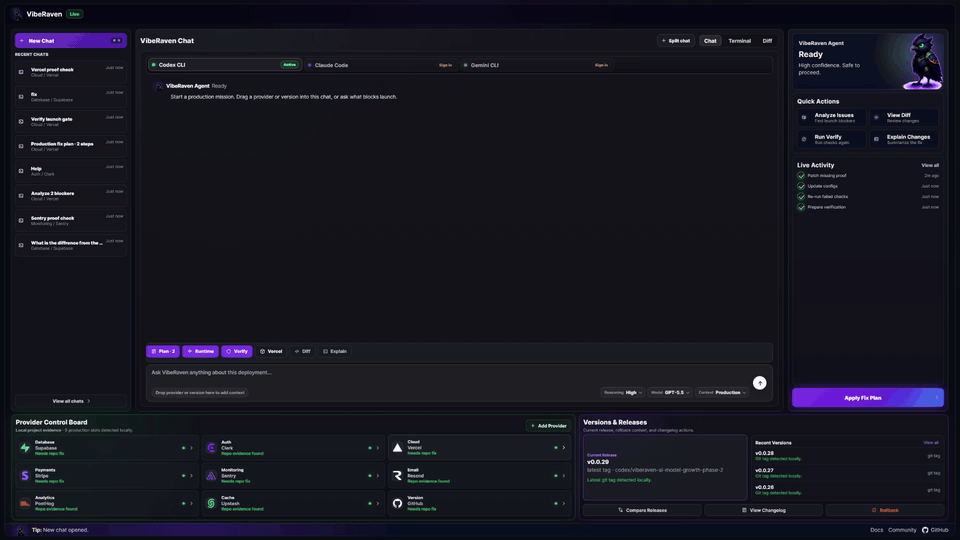

# VibeRaven

**Your AI agent builds it. VibeRaven controls it.**

Codex, Claude Code, Cursor, and Gemini can write the code — but they patch blind. VibeRaven is local mission control for AI-built products: your releases, providers, and launch risks, mapped in seconds and ready to drag into your agent.

```bash
npx -y viberaven
```



One command, zero config, fully local — no login, no API key, no telemetry. The Studio boots and maps **your** product: stack detected, providers found, git releases on a timeline, and a "can I ship?" verdict from offline checks.

## Your first 5 minutes

1. **Run it** — `npx -y viberaven` in your project folder. The Studio opens in your browser and scans your repo offline.
2. **Read your verdict** — the gate chip and Launch Signals show exactly what blocks launch, ranked. Click any signal → **Fix** hands it to your agent.
3. **Connect your coding agent** — pick Codex, Claude Code, or Gemini CLI in the chat panel, hit **Test connection**, and choose how much access it gets (`ask` / `approve` / `full`).
4. **Open the Architecture map** — pages, API, data, modules, and providers as a live draggable map. Weak boundaries glow red. Click one and press a plain-English action like *"Protect user data (RLS)"* or *"Fix slow queries"*.
5. **Open the Worktree** — your branches as a real tree. Uncommitted mess? One tap: *Commit with agent*. Branch ready? *Review* explains it in plain language, *Merge* does it safely.
6. **Give your agent the skills** — install the six-skill pack and the plugin so Codex, Claude Code, and Gemini follow the same senior-engineer loop everywhere:

   ```bash
   npx -y skills add ohad6k/VibeRaven --skill viberaven   # skills.sh pack
   npx -y viberaven init --agents all                     # agent rules in-repo
   ```

Everything the agent needs is also written to `.viberaven/` as markdown and JSON — readable by any tool, versioned by git.

## The terminal twin: `viberaven check`

For agents and CI, the same verdict as one command:

```bash
npx -y viberaven check
```

```text
viberaven check · ~/my-app

🔴 RLS disabled on public tables  (rls_profiles)
🟡 Service-role key referenced in client bundle  (service_role_client)
⚪ No error monitoring wired  (monitoring_missing)

Verdict: ❌ 1 blocker, 1 warning · score 62
Fix: viberaven fix · Details: .viberaven/agent-tasklist.md
```

One line per finding, `file:line` evidence in the artifacts, exit code `1` on blockers. Then:

```bash
npx -y viberaven fix            # list gaps with safe automatic recipes
npx -y viberaven fix --gap <id> # apply one recipe
npx -y viberaven --strict       # final gate before deploy or CI
```

Everything is written to `.viberaven/` as markdown and JSON on disk — `agent-tasklist.md`, `gate-result.json`, `context-map.json` — so any agent (and git) can read it.

## The Studio is an agent control room

- **Agentic chat on your repo** — connect Codex, Claude Code, or Gemini CLI and drive them from the Studio, with connection health and live terminal output.
- **Access modes** — `ask`, `approve`, or `full`: control how much your agent can do, Codex-style, and it changes the real agent command, not just the UI copy.
- **Drag context into the prompt** — drag a release, a provider card, or production memory into agent chat, so the agent patches with your product's versions, providers, and danger zones instead of guessing.
- **Providers via MCP** — connect Supabase, Vercel, and Stripe; provider status flows into agent prompts, and provider proof stays separate from repo-code fixes.
- **Versions & releases** — release diffs, tags, changelogs, and "what changed since the last working release."

## Install for AI agents

Make agents use release and provider context before they patch the repo:

```bash
npx -y viberaven init --agents all
npx -y viberaven doctor --agents
```

Preview without writing files:

```bash
npx -y viberaven init --agents all --dry-run
```

This installs bounded rules (`<!-- VIBERAVEN:START -->` ... `<!-- VIBERAVEN:END -->`) into:

- `AGENTS.md`, `CLAUDE.md`, `GEMINI.md`
- `.cursor/rules/viberaven-core.mdc` (+ scoped Supabase, deploy, payments rules)
- `.github/copilot-instructions.md`
- `.viberaven/agent-context.md`, `.viberaven/mission-map.md`

The rules teach the loop: `check` → read `.viberaven/` → fix one gap → `check` again, until `gate.status === "clear"`.

## Agent skills

Six [skills.sh](https://skills.sh) skills route agents through architecture questions, version evidence, and launch proof:

| Skill | Job |
| --- | --- |
| `viberaven` | The router: local check/fix loop, Studio, and MCP context. |
| `architecture-context` | Ask the missing product questions before any edit. |
| `architecture-plan` | Turn answers + repo evidence into a workstream plan. |
| `what-broke` | Find which version broke the app before patching. |
| `production-context` | Keep compact production memory in `.viberaven/production-context.md`. |
| `go-live` | Local app → GitHub → Vercel, with live-URL proof. |

```bash
npx -y skills add ohad6k/VibeRaven --skill viberaven
```

See [agent-skills/](./agent-skills/) for the full pack.

This repo also works as an agent **plugin**: `plugin.yaml`, `.claude-plugin/`, `.codex-plugin/`, and `gemini-extension.json` expose the six skills plus `/viberaven-work`, `/viberaven-help`, `/viberaven-production-context`, and `/viberaven-launch` commands to Claude Code, Codex, and Gemini CLI.

## MCP

VibeRaven is listed in the MCP registry for agents that prefer tools over terminal commands:

```json
{ "viberaven": { "command": "npx", "args": ["-y", "viberaven", "--mcp"] } }
```

Key tools: `viberaven_check_readiness` (runs the local check), `viberaven_heal_apply`, `viberaven_verify`, `viberaven_audit`, `viberaven_provider_verify`, and `viberaven_validate_npm_package` (run it before adding npm dependencies).

## Vercel + Supabase

```bash
npx -y viberaven audit --vercel-supabase
```

Local evidence checks for RLS proof, service-role exposure, and pooler ports before you claim "production ready."

## Philosophy

- **Local-first.** The CLI and Studio run on your machine. No login, no API key, no telemetry, no scan quota.
- **Markdown on disk.** All context lives in `.viberaven/` as plain files your agent and your git history can read.
- **Evidence over vibes.** Findings point at repo evidence; provider dashboard state is never claimed from repo edits alone.
- **Non-destructive.** Fix recipes are guarded, cleanup is plan-only, and nothing is pushed or deployed for you.

## Agent-ready starter template

[examples/nextjs-supabase-vercel-production-ready-template](./examples/nextjs-supabase-vercel-production-ready-template/) — agent rules and `viberaven:*` scripts for Next.js + Supabase + Vercel.

## Machine-readable docs

- [llms.txt](./llms.txt) · [llms-full.txt](https://viberaven.dev/llms-full.txt)
- [skills.json](https://viberaven.dev/skills.json) · [skills.sh.json](./skills.sh.json)
- [Example proof artifacts](./examples/proof/)

## Get the product

- Website: [viberaven.dev](https://viberaven.dev)
- npm: [viberaven](https://www.npmjs.com/package/viberaven)
- Issues: [ohad6k/VibeRaven/issues](https://github.com/ohad6k/VibeRaven/issues)

Current public release: `viberaven@1.3.1`.

If VibeRaven helps, star the repo so other AI app builders can find it. Use **Watch → Custom → Releases** for release notifications.

> This public repo is the agent discovery and installation surface. Product source development happens in a private repository.
