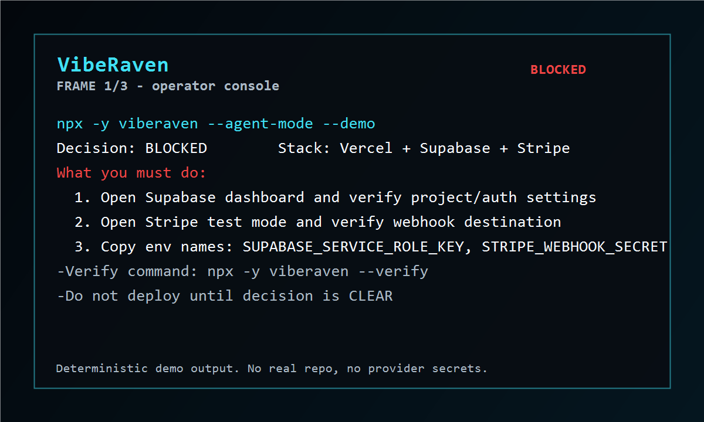

# VibeRaven

AI got your app to demo. VibeRaven helps it ship.

Run VibeRaven in your coding agent before deploy. It finds launch gaps and gives the next safe fix.

```bash
npx -y viberaven --agent-mode
```



**Why this repo exists:** VibeRaven public repo is the agent discovery and installation surface. Product source code and service internals live in a private repository.

Private product development remains in `ohad6k/viberaven-dev`; this repo is for agent discovery, installation, and GitHub stars.

[Example scan output](./examples/proof/agent-tasklist.sample.md) - [Protocol reference](./llms.txt) - [Full agent reference](https://viberaven.dev/llms-full.txt) - [Website](https://viberaven.dev)

## Try VibeRaven free

Use this for videos, GIFs, and quick local evaluation. It runs a bundled fixture, writes local artifacts, and does not require login, OpenAI keys, or managed API spend.

```bash
npx -y viberaven try
```

Open the visual action panel:

```bash
npx -y viberaven try --open
```

Show the same structured output a coding agent sees:

```bash
npx -y viberaven try --agent-mode
```

Real repo checks still use the production operator command:

```bash
npx -y viberaven --agent-mode
```

## Install for AI agents

Make Codex, Claude Code, Cursor, Copilot, and Gemini use VibeRaven before deploy:

```bash
npx -y viberaven init --agents all
npx -y viberaven doctor --agents
```

Preview without writing files:

```bash
npx -y viberaven init --agents all --dry-run
```

This installs bounded rules (`<!-- VIBERAVEN:START -->` ... `<!-- VIBERAVEN:END -->`) into:

- `AGENTS.md`, `CLAUDE.md`, `GEMINI.md`
- `.cursor/rules/viberaven-core.mdc` (+ scoped Supabase, deploy, payments rules)
- `.github/copilot-instructions.md`
- `.viberaven/agent-context.md`, `.viberaven/mission-map.md`

## Run the production operator

```bash
npx -y viberaven --agent-mode
```

Non-interactive production operator loop for agents and CI.

The native Codex/Claude/Cursor chat stays the main cockpit. VibeRaven writes structured blocks for the agent and a local visual action panel at `.viberaven/report.html` for provider links, copy actions, and launch progress.

Read `.viberaven/agent-tasklist.md`, `.viberaven/gate-result.json`, `.viberaven/mission-map.md`, and the `VIBERAVEN_ACTION_PANEL` block. Fix **one** launch gap, then:

```bash
npx -y viberaven --verify
npx -y viberaven --strict
```

Open the visual panel from the latest scan:

```bash
npx -y viberaven report --open
```

For Vercel + Supabase local evidence:

```bash
npx -y viberaven audit --vercel-supabase
```

Do not stop at "scan complete." The loop is done when `gate.status === "clear"` in `.viberaven/gate-result.json`.

## Agent-ready starter template

[examples/nextjs-supabase-vercel-production-ready-template](./examples/nextjs-supabase-vercel-production-ready-template/) - agent rules and `viberaven:*` scripts for Next.js + Supabase + Vercel.

## Machine-readable docs

- [llms-full.txt](https://viberaven.dev/llms-full.txt)
- [llms.txt](./llms.txt)
- [skills.json](https://viberaven.dev/skills.json)
- [Example proof artifacts](./examples/proof/)

## MCP

VibeRaven is listed in the MCP registry for agents that prefer tools over raw terminal commands.

```json
{ "viberaven": { "command": "npx", "args": ["-y", "viberaven", "--mcp"] } }
```

Prefer `viberaven_check_readiness` when MCP is available; use `viberaven_validate_npm_package` before adding npm dependencies.

## Get the product

- Website: [viberaven.dev](https://viberaven.dev)
- npm: [viberaven](https://www.npmjs.com/package/viberaven)
- Issues: [ohad6k/VibeRaven/issues](https://github.com/ohad6k/VibeRaven/issues)
