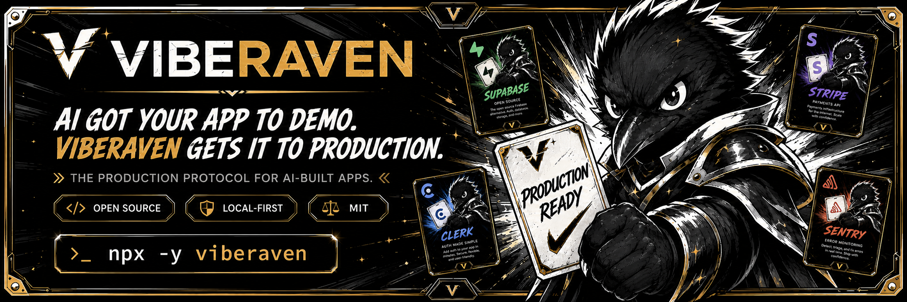

<div align="center">
  

  <p>
    <a href="https://viberaven.dev"></a>
    &nbsp;
    <a href="https://www.npmjs.com/package/viberaven"></a>
    &nbsp;
    <a href="https://discord.gg/ZAJvazz63Y"></a>
  </p>

  <p>
    <a href="https://www.npmjs.com/package/viberaven"></a>
    <a href="https://www.npmjs.com/package/viberaven"></a>
    <a href="https://github.com/ohad6k/VibeRaven/stargazers"></a>
    <a href="./LICENSE"></a>
    <a href="https://skills.sh"></a>
    <a href="https://x.com/VibeRavenStatio"></a>
  </p>
  <p>
    <a href="https://viberaven.dev">Website</a> ·
    <a href="#your-first-5-minutes">Quickstart</a> ·
    <a href="#agent-skills">Agent skills</a> ·
    <a href="https://github.com/ohad6k/VibeRaven/releases">Releases</a> ·
    <a href="https://github.com/ohad6k/VibeRaven/discussions">Discussions</a>
  </p>
</div>

VibeRaven is an open-source local cockpit for AI-built apps. Run `npx -y viberaven` in your repo and it connects your coding agent (Claude Code, Codex, Gemini) to the context it patches blind without, your architecture, providers, and releases, then shows what is actually safe to ship to production, auth, RLS, webhooks, deploy, before real users hit it. Local-first, no login.

```bash
npx -y viberaven
```

The Studio opens in your browser and works entirely on your machine: it detects your stack, finds your providers, shows your release history and diffs, and gives you a "can I ship?" verdict from offline checks. No login, no API key, no telemetry.

## Your first 5 minutes

1. **Run it.** `npx -y viberaven` in your project folder. The Studio opens in your browser and scans your repo offline.
2. **Read your verdict.** The Studio shows a readiness score out of 100 and the blockers it found in your repo files. Pick one and hand it to your agent to fix.
3. **Connect your coding agent.** Pick Codex, Claude Code, or Gemini CLI in the chat panel, hit **Test connection**, and choose how much access it gets (`ask`, `approve`, or `full`).
4. **Give your agent the skills.** Install the six-skill pack and the plugin so Codex, Claude Code, and Gemini follow the same senior-engineer loop everywhere:

   ```bash
   npx -y skills add ohad6k/VibeRaven --skill viberaven   # skills.sh pack
   npx -y viberaven init --agents all                     # agent rules in-repo
   ```

Everything the agent needs is also written to `.viberaven/` as markdown and JSON, readable by any tool and versioned by git.

## What the Studio gives you

| Capability | What it does |
| --- | --- |
| **Agent chat on your repo** | Drive Codex, Claude Code, or Gemini CLI from one cockpit, with connection health and live terminal output. |
| **Access modes** | `ask`, `approve`, or `full`. The mode changes the real agent command it runs, not just the UI copy. |
| **Versions & releases** | Release diffs, tags, changelogs, and "what changed since the last working release" in plain English. |
| **Providers via MCP** | Connect Supabase, Vercel, and Stripe. Provider status flows into agent prompts, and provider proof stays separate from repo-code fixes. |

## The terminal twin: `viberaven check`

For agents and CI, the same verdict as one command:

```bash
npx -y viberaven check
```

```text
viberaven check · ~/my-app

🔴 RLS disabled on public tables  (rls_profiles)
🟡 Service-role key referenced in client bundle  (service_role_client)
⚪ No error monitoring wired  (monitoring_missing)

Verdict: ❌ 1 blocker, 1 warning · score 62
Fix: viberaven fix · Details: .viberaven/agent-tasklist.md
```

One line per finding, `file:line` evidence in the artifacts, exit code `1` on blockers. Then:

```bash
npx -y viberaven fix            # list gaps with safe automatic recipes
npx -y viberaven fix --gap <id> # apply one recipe
npx -y viberaven --strict       # strict pass before deploy or CI (exit 1 when the gate is not clear; warnings exit 0)
```

All results land in `.viberaven/` as markdown and JSON on disk (`agent-tasklist.md`, `gate-result.json`, `context-map.json`), so any agent and your git history can read them.

## Install for AI agents

Make agents use release and provider context before they patch the repo:

```bash
npx -y viberaven init --agents all
npx -y viberaven doctor --agents
```

Preview without writing files:

```bash
npx -y viberaven init --agents all --dry-run
```

This installs bounded rules (`<!-- VIBERAVEN:START -->` ... `<!-- VIBERAVEN:END -->`) into:

- `AGENTS.md`, `CLAUDE.md`, `GEMINI.md`
- `.cursor/rules/viberaven-core.mdc` (plus scoped Supabase, deploy, and payments rules)
- `.github/copilot-instructions.md`
- `.viberaven/agent-context.md`, `.viberaven/mission-map.md`

The rules teach the loop: `check`, read `.viberaven/`, fix one gap, then `check` again until `gate.status === "clear"`.

## Agent skills

Six [skills.sh](https://skills.sh) skills route agents through architecture questions, version evidence, and launch proof:

| Skill | Job |
| --- | --- |
| `viberaven` | The router: local check/fix loop, Studio, and MCP context. |
| `architecture-context` | Ask the missing product questions before any edit. |
| `architecture-plan` | Turn answers plus repo evidence into a workstream plan. |
| `what-broke` | Find which version broke the app before patching. |
| `production-context` | Keep compact production memory in `.viberaven/production-context.md`. |
| `go-live` | Local app to GitHub to Vercel, with live-URL proof. |

```bash
npx -y skills add ohad6k/VibeRaven --skill viberaven
```

See [agent-skills/](./agent-skills/) for the full pack.

This repo also works as an agent **plugin**: `plugin.yaml`, `.claude-plugin/`, `.codex-plugin/`, and `gemini-extension.json` expose the six skills plus `/viberaven-work`, `/viberaven-help`, `/viberaven-production-context`, and `/viberaven-launch` commands to Claude Code, Codex, and Gemini CLI.

For a smaller install, [plugins/viberaven](./plugins/viberaven/) is a standalone plugin for Claude Code and Cursor: one skill that says when a pre-launch pass fits a Vercel + Supabase app, plus the MCP server pinned to `@viberaven/mcp@1.5.2`.

## MCP

VibeRaven is listed in the MCP registry for agents that prefer tools over terminal commands:

```json
{ "viberaven": { "command": "npx", "args": ["-y", "@viberaven/mcp"] } }
```

Key tools: `viberaven_check_readiness` (runs the local check), `viberaven_heal_apply`, `viberaven_verify`, `viberaven_audit`, `viberaven_gate_result`, and `viberaven_validate_npm_package` (run it before adding npm dependencies).

## Vercel + Supabase

```bash
npx -y viberaven audit --vercel-supabase
```

Repository evidence for RLS, service-role exposure, and pooler ports. It reads repo files only, so it cannot show which RLS policies are live in your Supabase project.

## Philosophy

- **Local-first.** The CLI and Studio run on your machine. No login, no API key, no telemetry. Local checks in the CLI and Studio are free with no quota. Hosted full checks (the Studio's "Run full check" from 1.5.0, and the VS Code extension) use your account's allowance: 2 on Free, 50 a month on [Pro](https://viberaven.dev/pricing).
- **Markdown on disk.** All context lives in `.viberaven/` as plain files that your agent and your git history can read.
- **Evidence over vibes.** Findings point at repo evidence. Provider dashboard state is never claimed from repo edits alone.
- **Non-destructive.** Fix recipes are guarded, cleanup is plan-only, and nothing is pushed or deployed for you.

## Contributing

Contributions are welcome, and most of them need no private source access:

- Read the [contribution guide](./CONTRIBUTING.md) for repo structure, PR expectations, and local checks.
- Pick up a [good first issue](https://github.com/ohad6k/VibeRaven/issues?q=is%3Aissue+is%3Aopen+label%3A%22good+first+issue%22): docs, provider fixtures, examples, and translations.
- Share ideas or questions in [Discussions](https://github.com/ohad6k/VibeRaven/discussions).
- Join the [Discord](https://discord.gg/ZAJvazz63Y) to talk to the maintainer directly.

## Resources

- Agent-ready starter template: [examples/nextjs-supabase-vercel-production-ready-template](./examples/nextjs-supabase-vercel-production-ready-template/)
- Machine-readable docs: [llms.txt](./llms.txt) · [llms-full.txt](https://viberaven.dev/llms-full.txt) · [skills.json](https://viberaven.dev/skills.json) · [skills.sh.json](./skills.sh.json)
- Example proof artifacts: [examples/proof/](./examples/proof/)
- Website: [viberaven.dev](https://viberaven.dev) · npm: [viberaven](https://www.npmjs.com/package/viberaven) · Issues: [ohad6k/VibeRaven/issues](https://github.com/ohad6k/VibeRaven/issues)

## License

[MIT](./LICENSE). Current public release: `viberaven@1.5.2`.

Built by Ohad Krispin ([github.com/ohad6k](https://github.com/ohad6k)).

If VibeRaven helps you ship, star the repo so other AI app builders can find it. Use **Watch → Custom → Releases** for release notifications.

> This public repo is the agent discovery and installation surface. Product source development happens in a private repository.
