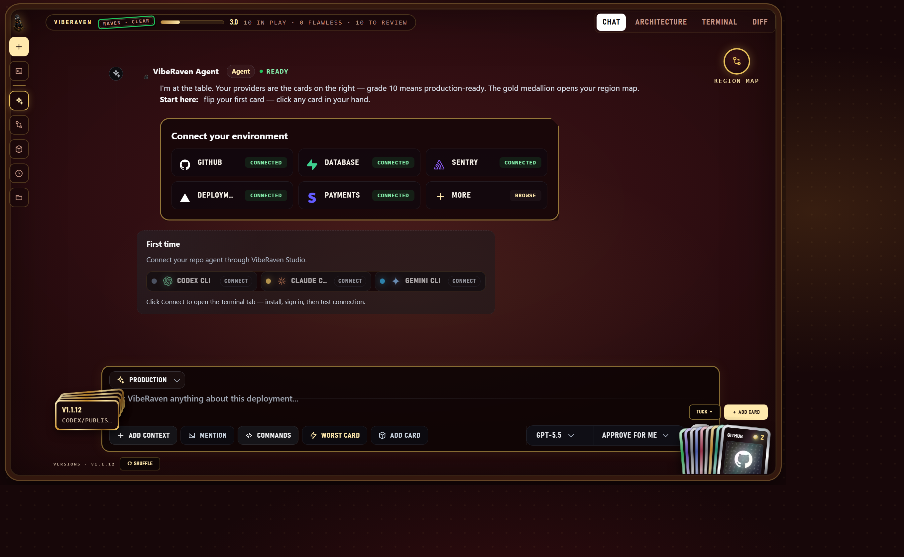

# After-launch workflow

Shipping isn't the end of the loop — it's where VibeRaven starts earning its
keep. This is the Layer 2 workflow: what to do once a release is live and
you want to know what changed, feed that into your agent, and keep proof of
what actually happened.


## Before you start

You need a release already shipped (see the README's terminal-twin section
for `viberaven check` / `viberaven fix` if you haven't run the pre-deploy
gate yet) and the Studio installed:

```bash
npx -y viberaven
```

## The walkthrough

1. **Open the Studio.**
   Run `npx -y viberaven` in your repo and open the URL it prints. The
   Studio detects your stack, finds your providers, and puts your git
   releases on a timeline — no login, no API key.

   

2. **Compare versions.**
   Open "Versions & releases" and pick the last known-good release and the
   one you just shipped. VibeRaven diffs dependencies, schema/migrations,
   env vars, and provider config between the two, and flags anything that
   got riskier — not just anything that's broken in isolation. See the
   [version comparison explainer](version-comparison.md) for a full worked
   example of what a regression looks like in this view.

3. **Check the provider cards for the release.**
   Any provider card that moved from ✅ to 🔴 or ⚠️ between the two
   versions is worth a look before you trust the release. The
   [provider control board explainer](provider-control-board.md) covers
   what healthy vs. drifted means for each provider, and which of that
   state VibeRaven actually verified live (Supabase, Vercel, Stripe) versus
   inferred from the repo (everything else).

4. **Drag context into agent chat.**
   From the release diff or a provider card, drag the item into the agent
   chat panel. This is the "context you can drag" row from the README's
   feature table: instead of describing the regression in prose, the
   agent gets the actual diff or provider state as context, so it patches
   against your product's real history instead of guessing.

5. **Ask one narrow question.**
   With that context loaded, ask the agent a single, scoped question — e.g.
   "why did the Stripe webhook card go red between these two releases?" —
   rather than a broad "what's wrong with my app?" A narrow question
   against real context gets a narrow, checkable answer instead of a
   speculative audit.

6. **Export release proof.**
   Once you're satisfied with the diff and the agent's read on it, export
   the release proof report. It captures the same evidence categories used
   in the version diff (dependencies, schema, env vars, provider config)
   as one artifact you can attach to a PR, a postmortem, or a changelog
   entry — see
   [`examples/release-drift/release-proof-report.md`](../examples/release-drift/release-proof-report.md)
   for the shape of a real one.

## Where this fits

This loop is meant to run every time you ship, not just after an incident:
open the Studio, compare the version you just shipped against the last
known-good one, drag whatever looks riskier into agent chat, ask a narrow
question, and keep the proof. It pairs with the pre-deploy gate
(`viberaven check` / `viberaven --strict`) from the other side of the
release — that gate stops a bad release from shipping; this workflow tells
you what actually changed once one did.
